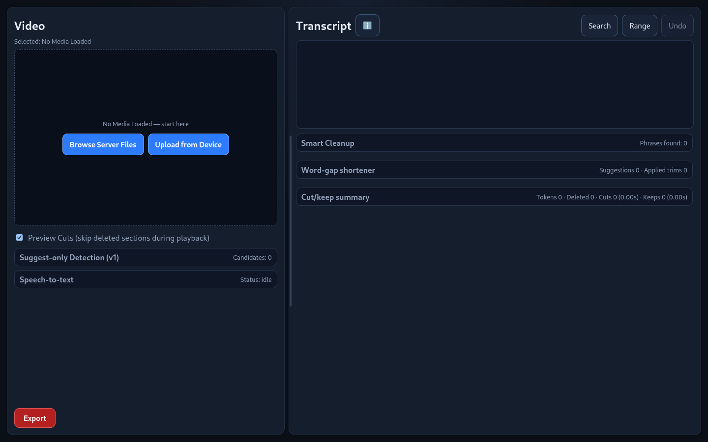
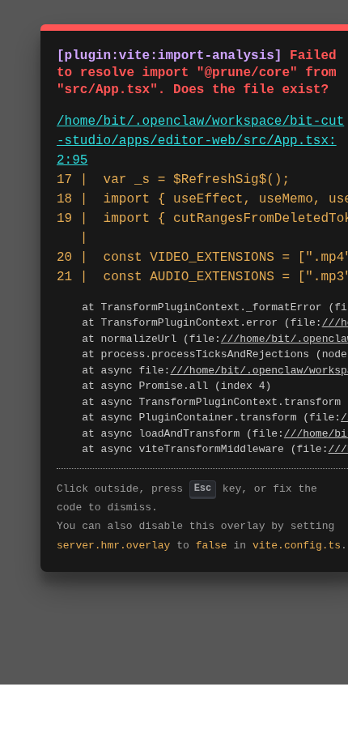

<div align="center">
  <a href="https://github.com/SloPOS/Prune" target="_blank">
    
  </a>

  # Prune
  **Rough cuts at the speed of text.**

  [](mailto:Faux@fauxrhino.com)
  [](#)
</div>

<br />

**Prune** is a transcript-first video editor designed for self-hosted workflows. Instead of endlessly scrubbing through a timeline to find the best takes, Prune lets you edit spoken content by simply editing the words on the screen. 

Select a word, phrase, or entire paragraph in the transcript to remove it, and Prune will automatically generate the precise timeline cuts. From there, you can quickly preview your rough cut and export it directly to media or seamlessly send it to your favorite Non-Linear Editor (NLE) via interchange formats. 

---

##  See it in Action

### Desktop Editor
Take advantage of screen real estate with our split-pane desktop editor. 



### Mobile Layout
Edit on the go. Our mobile view features a tabbed layout (Media / Transcript / Tools / Export) with portrait-optimized settings and tab-scoped popups so you never lose your modal state. 



---

##  Core Features

###  Transcript-First Editing
Visually sculpt your video by reading, not just watching.
* **Click to Cut:** Simply click words to toggle them between removed and restored.
* **Bulk Selection:** Use drag-range multi-select on desktop or the dedicated range mode on mobile to cut entire sections at once.

###  Built-In AI Transcription
Powered by Whisper STT, completely integrated into the app.
* **Tailored Accuracy:** Choose between Fast, Balanced, or Quality preset modes depending on your hardware.
* **Workflow Friendly:** Features background progress tracking, ETA estimates, and automatic transcript loading the moment processing is complete.

###  Smart Cleanup & Cut Helpers
Stop hunting for dead air. Let Prune find it for you.
* **Silence Removal:** Automatically shorten word gaps.
* **Crutch Words:** Utilize fixed-phrase cleanup to ditch the "ums" and "ahs".
* **Audio Polishing:** Take advantage of suggest-only breath and noise detection to keep your audio clean.

###  Robust Project Management
* **State Persistence:** Save, load, or delete named project states.
* **Total Recall:** Instantly restore your exact transcript, deleted tokens, and trim settings.
* **Cross-Platform Files:** Features a server-side folder picker, local upload support, and dedicated directories for your transcripts, projects, and exports.

###  Render Without Transcripts
Just need a quick conversion? Prune's video/audio render engine supports full-range remux and re-encode workflows even when you haven't loaded a transcript.

---

##  Export & Interchange

Prune is designed to be the ultimate middleman between your raw footage and your final polish. 

### Media Exports
* Edited video and audio rendering (`.mp4`)

### NLE Interchange Formats
Send your timeline directly to your heavy-duty editor of choice:
* DaVinci Resolve / Final Cut Pro (`.fcpxml`)
* Premiere Pro (`.xml`)
* CMX3600 EDL (`.edl`)
* After Effects markers (`.json`)
* AAF bridge package (`.zip`) featuring an OTIO conversion script and fallback timelines

### Subtitles & Scripts
* `.srt`, `.vtt`, and raw script `.txt`

> **Note on Download/Cache Behavior:** Small sidecar exports (like XML, EDL, JSON) trigger an immediate browser download and are then automatically removed from the server. Larger rendered media exports remain cached on the server, respecting your configured retention window.

---

##  Quick Start & Deployment

### One-Command Installer
For the fastest automated setup, run our installation script directly in your terminal:
```bash
curl -fsSL [https://raw.githubusercontent.com/SloPOS/Prune/main/scripts/install-prune.sh](https://raw.githubusercontent.com/SloPOS/Prune/main/scripts/install-prune.sh) | bash

```

### Docker Compose (Recommended)

The easiest and most reliable way to run Prune locally is via Docker.

```bash
git clone [https://github.com/SloPOS/Prune.git](https://github.com/SloPOS/Prune.git)
cd Prune
docker compose up -d --build

```

**App URL:** Once the container is running, open your browser and head to: `http://localhost:4173`

### Manual Local Install

If you prefer to run the environment manually without Docker, ensure your system has the following installed:

* Node.js 20+
* Python 3.10+
* ffmpeg + ffprobe (must be added to your system PATH)

```bash
npm install
npm run dev -w @prune/editor-web

```

Once the server starts, open the local Vite URL shown in your terminal.

---

##  Validation Suites

If you are modifying the export engines, you can run our export-focused automated checks to ensure stability:

```bash
npm run test:exports
npm run test:interop

```

These suites validate timeline parity and continuity across all export formats, and run contract checks for the download behaviors.

---

*Designed by Jacob "FauxRhino" · Reach out at [Faux@fauxrhino.com*](mailto:Faux@fauxrhino.com)


