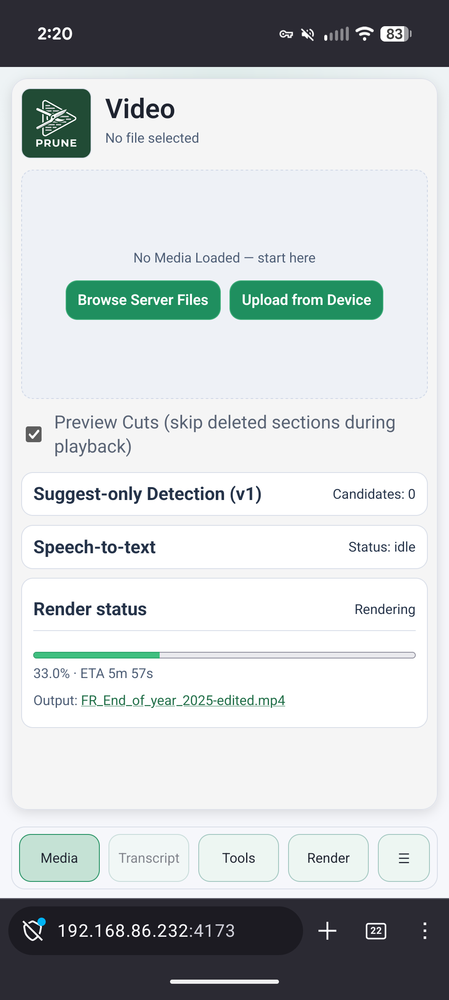
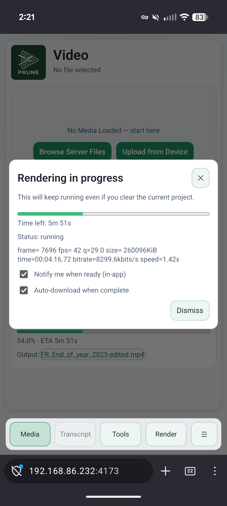
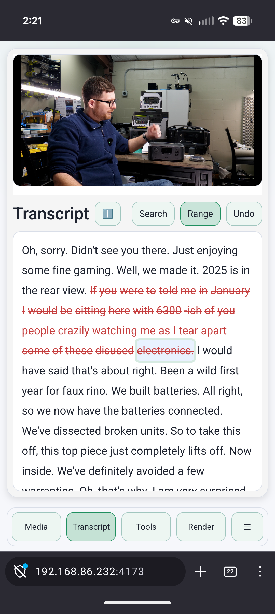
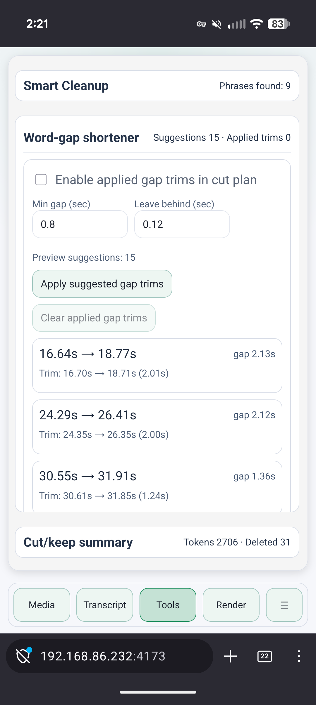
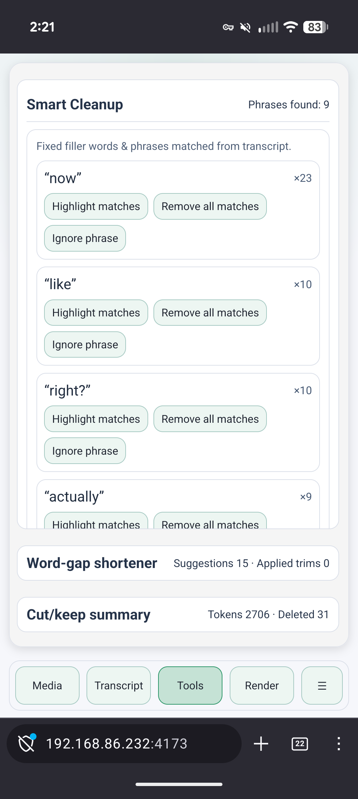
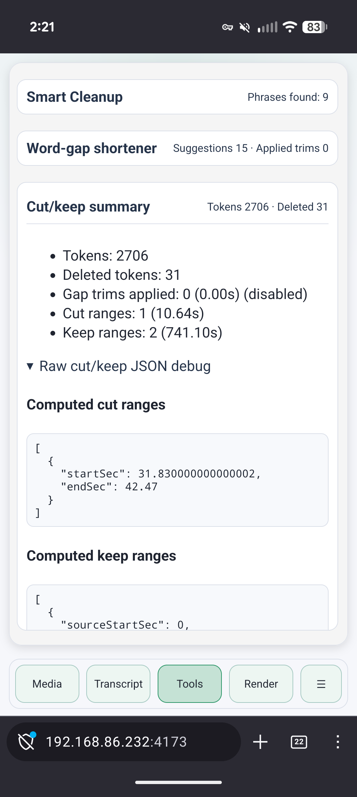
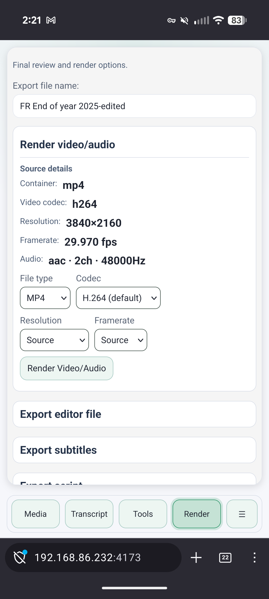
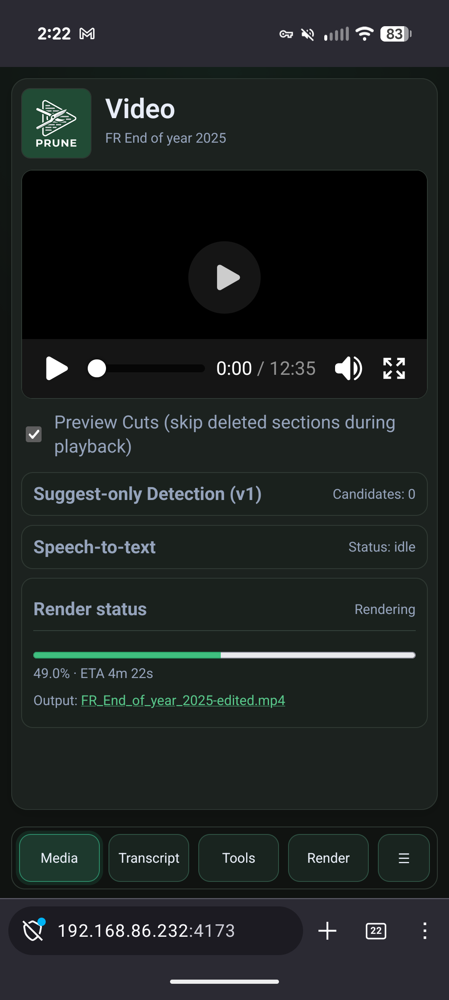

<div align="center">
  <a href="https://github.com/SloPOS/Prune" target="_blank">
    
  </a>

  # Prune
  **Rough cuts at the speed of text.**

  [](mailto:Faux@fauxrhino.com)
  [](#)
  <hr>
  Come hang out on Discord: https://discord.gg/URUV5cV6Vc
</div>

<br />

**Prune** is a transcript-first video editor designed for self-hosted workflows. Instead of endlessly scrubbing through a timeline to find the best takes, Prune lets you edit spoken content by simply editing the words on the screen. 

Select a word, phrase, or entire paragraph in the transcript to remove it, and Prune will automatically generate the precise timeline cuts. From there, you can quickly preview your rough cut and export it directly to media or seamlessly send it to your favorite Non-Linear Editor (NLE) via interchange formats. 

---

##  See it in Action

### Desktop Editor
Take advantage of screen real estate with our split-pane desktop editor. 

<center>
  
 

</center>

### Mobile Layout
Edit on the go. Our mobile view features a tabbed layout (Media / Transcript / Tools / Export) with portrait-optimized settings and tab-scoped popups so you never lose your modal state. 


<table>
  <tr>
    <td align="center"><br /><sub>Starting page</sub></td>
    <td align="center"><br /><sub>Render in progress</sub></td>
    <td align="center"><br /><sub>Edit in progress</sub></td>
  </tr>
  <tr>
    <td align="center"><br /><sub>Word gap shortner feature</sub></td> 
    <td align="center"><br /><sub>Smart Cleanup feature</sub></td>
    <td align="center"><br /><sub>Raw output of cut/kept files</sub></td>
  </tr>
  <tr>
    <td align="center"><br /><sub>Render settings</sub></td>
    <td align="center"><br /><sub>Dark mode</sub></td>
    <td></td>
  </tr>
</table>

---

##  Core Features

###  Transcript-First Editing
Visually sculpt your video by reading, not just watching.
* **Click to Cut:** Simply click words to toggle them between removed and restored.
* **Bulk Selection:** Use drag-range multi-select on desktop or the dedicated range mode on mobile to cut entire sections at once.

###  Built-In AI Transcription
Powered by Whisper STT, completely integrated into the app.
* **Tailored Accuracy:** Choose between Fast, Balanced, or Quality preset modes depending on your hardware.
* **Workflow Friendly:** Features background progress tracking, ETA estimates, and automatic transcript loading the moment processing is complete.

###  Smart Cleanup & Cut Helpers
Stop hunting for dead air. Let Prune find it for you.
* **Silence Removal:** Automatically shorten word gaps.
* **Crutch Words:** Utilize fixed-phrase cleanup to ditch the "ums" and "ahs".
* **Audio Polishing:** Take advantage of suggest-only breath and noise detection to keep your audio clean.

###  Robust Project Management
* **State Persistence:** Save, load, or delete named project states.
* **Total Recall:** Instantly restore your exact transcript, deleted tokens, and trim settings.
* **Cross-Platform Files:** Features a server-side folder picker, local upload support, and dedicated directories for your transcripts, projects, and exports.

###  Render Status + In-App Notifications
Long renders should not feel like guesswork.
* **Global Render Status:** A dedicated Render Status widget tracks FFmpeg state (Idle / Rendering / Finished / Error) even if you close the render popup.
* **Live Progress + ETA:** Status bars and time-left estimates are synchronized across the widget and render-progress popup.
* **In-App Alerts:** Optional completion alerts include sound, popup notification, and favicon badge so you'll know when a render is done.
* **Download Control:** Choose to auto-download on completion or download manually from the completion notification.

###  Polished Desktop + Mobile UX
* **Draggable Desktop Popups:** Major desktop modals can be moved around the viewport while staying window-bounded.
* **Mobile-First Layout:** Tab-scoped modals and accordion-based controls keep the interface usable on smaller screens without removing desktop capability.

###  Render Without Transcripts
Just need a quick conversion? Prune's video/audio render engine supports full-range remux and re-encode workflows even when you haven't loaded a transcript.

---

##  Export & Interchange

Prune is designed to be the ultimate middleman between your raw footage and your final polish. 

### Media Exports
* Edited video and audio rendering (`.mp4`)

### NLE Interchange Formats
Send your timeline directly to your heavy-duty editor of choice:
* DaVinci Resolve / Final Cut Pro (`.fcpxml`)
* Premiere Pro (`.xml`)
* CMX3600 EDL (`.edl`)
* After Effects markers (`.json`)
* AAF bridge package (`.zip`) featuring an OTIO conversion script and fallback timelines

### Subtitles & Scripts
* `.srt`, `.vtt`, and raw script `.txt`

> **Note on Download/Cache Behavior:** Small sidecar exports (like XML, EDL, JSON) trigger an immediate browser download and are then automatically removed from the server. Larger rendered media exports remain cached on the server, respecting your configured retention window.

---

##  Quick Start & Deployment

> **Security note:** Prune's API is unauthenticated and can browse the host
> filesystem, so treat it as a tool on your own machine rather than a public
> service. Outside Docker it binds to `127.0.0.1` by default. Only expose it
> on a network you trust, and never put it directly on the public internet.

### Docker Compose (Recommended)

```bash
git clone https://github.com/SloPOS/Prune.git
cd Prune
docker compose up -d --build
```

Compose builds the image from your checkout, so you always run the code you
cloned.

The port is published on all interfaces so server and NAS deployments work
out of the box. To restrict Prune to the local machine:

```bash
PRUNE_BIND=127.0.0.1 docker compose up -d
```

**App URL:** Once the container is running, open `http://localhost:4173`

Prebuilt multi-architecture images (linux/amd64 and linux/arm64) are also
published for each release if you would rather not build:

```bash
docker run -d -p 4173:4173 -v prune_data:/data fauxrhino/prune:1.0.0
```

### One-Command Installer

For an automated setup on Linux or macOS:

```bash
curl -fsSL https://raw.githubusercontent.com/SloPOS/Prune/main/scripts/install-prune.sh | bash
```

The installer pins to the latest tagged release. Override it to track the
development branch or pick a specific version:

```bash
PRUNE_REF=main curl -fsSL https://raw.githubusercontent.com/SloPOS/Prune/main/scripts/install-prune.sh | bash
```

### Homebrew (macOS)

Install Prune via the Homebrew tap:

```bash
brew tap SloPOS/prune
brew install prune
prune
```

Then open: `http://localhost:4173`

### Manual Local Install

If you prefer to run the environment manually without Docker, ensure your
system has the following installed:

* Node.js 20+
* Python 3.10+
* ffmpeg + ffprobe (must be added to your system PATH)

```bash
npm ci
npm run build
npm run start:prod
```

Then open `http://localhost:4173`.

To reach Prune from another machine on your network, bind it explicitly --
read the security note above first:

```bash
HOST=0.0.0.0 npm run start:prod
```

For frontend work with hot reload use `npm run dev`; that serves the Vite
dev server and is not intended as a production command.

##  Validation Suites

If you are modifying the export engines, you can run our export-focused automated checks to ensure stability:

```bash
npm run test:exports
npm run test:interop

```

These suites validate timeline parity and continuity across all export formats, and run contract checks for the download behaviors.

The full gate CI runs, including the typecheck that covers the backend API
plugin in `apps/editor-web/vite.config.ts`:

```bash
npm run ci
```

---

##  License

Released under the [MIT License](LICENSE).

---

*Designed by Jacob "FauxRhino" · Reach out at [Faux@fauxrhino.com*](mailto:Faux@fauxrhino.com)


